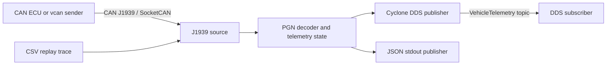

# CAN J1939 to DDS Gateway

[](https://github.com/med1001/j1939-dds-gateway/actions/workflows/ci.yml)
[](LICENSE)

A production-oriented C11 demo that receives vehicle telemetry over Linux
SocketCAN/J1939, decodes selected Parameter Group Numbers (PGNs), and publishes
the resulting state through Eclipse Cyclone DDS.

The repository is designed to run without CAN hardware: a deterministic CSV
replay mode exercises the complete input/decoder/publisher pipeline, while a
`vcan` demo validates the native Linux J1939 socket path.

## Highlights

- C11 with strict compiler warnings and no application-level dependencies for the core.
- Native Linux `CAN_J1939` datagram sockets; no raw CAN reimplementation.
- Cyclone DDS C API with an IDL-defined `VehicleTelemetry` topic.
- Reliable, transient-local DDS QoS with a keep-last history.
- Hardware-free CSV replay and Linux `vcan` demo sender.
- Unit and pipeline tests through CTest, with optional ASan/UBSan.
- Linux and Windows core CI plus a complete Cyclone DDS build in GitHub Actions.
- Docker development image for reproducible full builds.

## Architecture



The input and publishing ports are separated from the decoder so that parsing
can be tested deterministically and additional PGNs or publishers can be added
without changing the transport code. See [Architecture](docs/architecture.md).

## Supported demo PGNs

| PGN | Name | Decoded signal |
|---:|---|---|
| 61444 (`0xF004`) | Electronic Engine Controller 1 | Engine speed |
| 65265 (`0xFEF1`) | Cruise Control / Vehicle Speed 1 | Wheel-based vehicle speed |
| 65262 (`0xFEEE`) | Engine Temperature 1 | Engine coolant temperature |

These mappings are intentionally limited to a demonstrator. Production use
must validate SPN definitions, scaling, availability values, source addressing,
and transport behavior against the licensed SAE J1939 specifications for the
target vehicle.

## Quick start: replay mode

Requirements: CMake 3.20+ and a C11 compiler.

```bash
cmake -S . -B build -DCMAKE_BUILD_TYPE=Debug
cmake --build build --parallel
ctest --test-dir build --output-on-failure
./build/j1939_dds_gateway --replay samples/j1939_frames.csv
```

The default publisher prints one JSON object per decoded message. The telemetry
state is cumulative, so each output includes the last valid value received for
every supported signal.

## Full Cyclone DDS build

If Cyclone DDS is already installed, CMake finds its package automatically:

```bash
cmake -S . -B build-dds \
  -DCMAKE_BUILD_TYPE=Release \
  -DJ1939_DDS_ENABLE_CYCLONEDDS=ON
cmake --build build-dds --parallel
```

For a self-contained developer build, let CMake fetch the pinned Cyclone DDS
release:

```bash
cmake -S . -B build-dds \
  -DCMAKE_BUILD_TYPE=Release \
  -DJ1939_DDS_ENABLE_CYCLONEDDS=ON \
  -DJ1939_DDS_FETCH_CYCLONEDDS=ON
cmake --build build-dds --parallel
```

Run the subscriber first, then replay the sample trace through DDS:

```bash
./build-dds/telemetry_subscriber --domain 0
./build-dds/j1939_dds_gateway \
  --replay samples/j1939_frames.csv \
  --publisher dds \
  --domain 0
```

## Live Linux J1939 demo with `vcan`

> Some default WSL kernels do not include the `vcan` module. In that case, use
> a native Linux host or the replay mode; replay and DDS need no CAN hardware.

Create a virtual CAN interface:

```bash
./scripts/setup_vcan.sh vcan0
```

Start the gateway in one terminal:

```bash
./build/j1939_dds_gateway --interface vcan0 --publisher stdout
```

Send three valid J1939 messages from another terminal:

```bash
./build/j1939_demo_sender vcan0
```

The same input can be forwarded to DDS by selecting `--publisher dds` in a
Cyclone-enabled build. Detailed commands are in [Demo guide](docs/demo.md).

## Docker

Build the complete project, including Cyclone DDS:

```bash
docker build -t j1939-dds-gateway .
docker run --rm j1939-dds-gateway
```

The default container command runs the replay trace with the JSON publisher.
Use Docker host networking on Linux when experimenting with DDS discovery or a
host CAN interface.

## Tests and quality gates

```bash
cmake -S . -B build-sanitize \
  -DCMAKE_BUILD_TYPE=Debug \
  -DJ1939_DDS_ENABLE_SANITIZERS=ON
cmake --build build-sanitize --parallel
ctest --test-dir build-sanitize --output-on-failure
```

The test suite checks signal scaling, unavailable values, malformed payloads,
unsupported PGNs, CSV parsing, and the replay-to-decoder integration path. See
[Testing](docs/testing.md).

## Repository layout

```text
include/j1939_dds/  Public core interfaces
src/                Decoder, sources, publishers and executables
idl/                DDS topic definition
tests/              Unit and integration tests
samples/            Hardware-free J1939 trace
docs/               Architecture, demo and testing notes
scripts/            Linux vcan helper
```

## References

- [Linux kernel J1939 documentation](https://docs.kernel.org/networking/j1939.html)
- [Linux kernel SocketCAN documentation](https://docs.kernel.org/networking/can.html)
- [Eclipse Cyclone DDS documentation](https://cyclonedds.io/docs/cyclonedds/latest/)

## License

[MIT](LICENSE)
